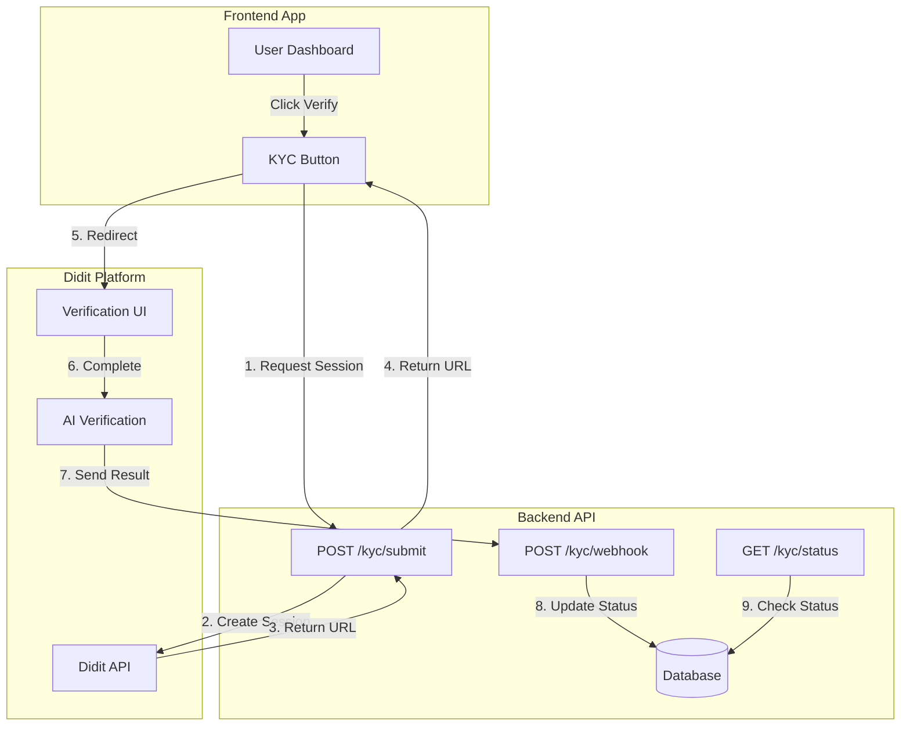
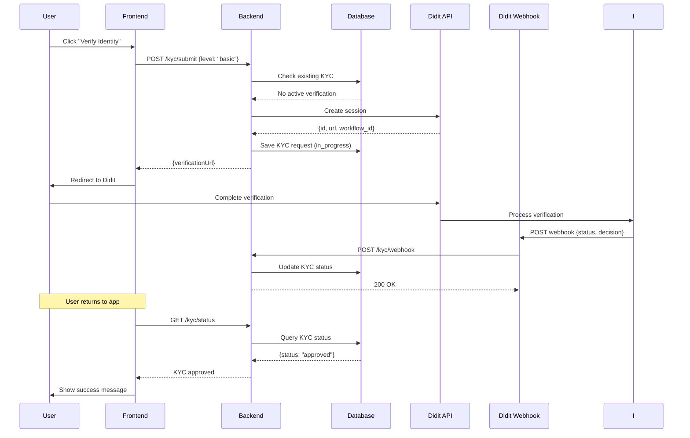
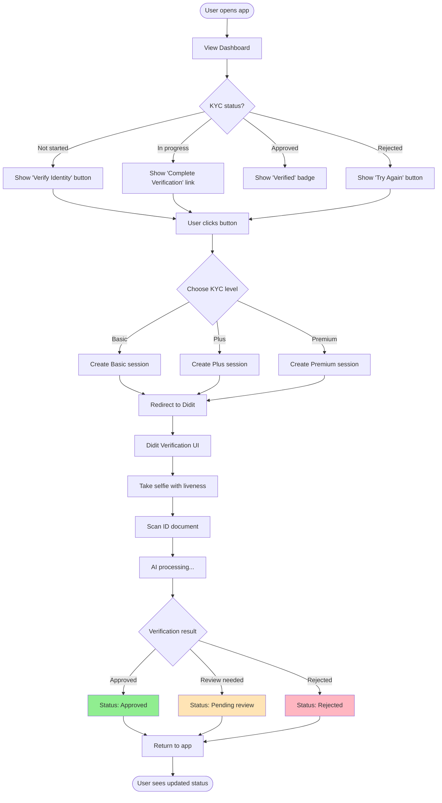
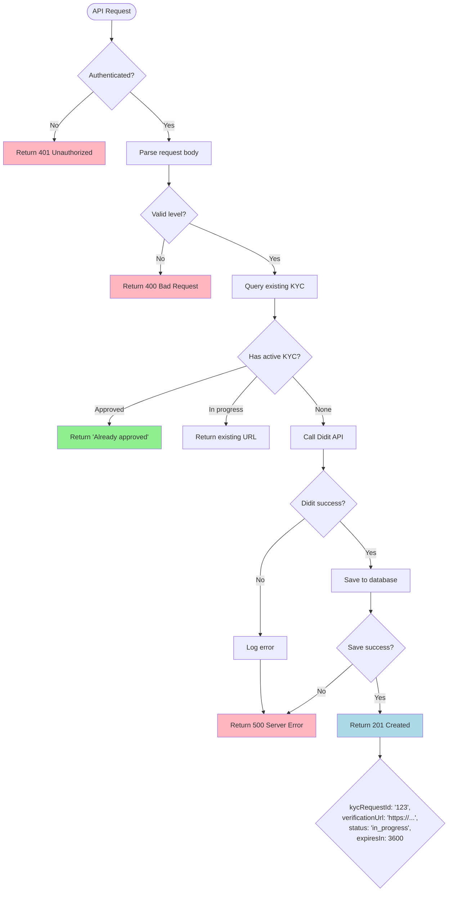
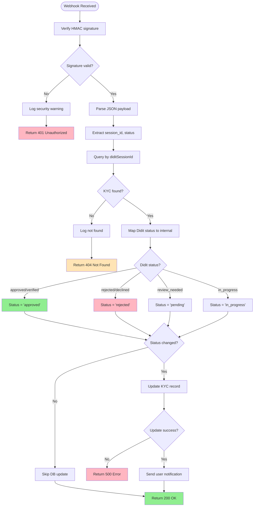

# Didit KYC Integration - Technical Documentation

## Table of Contents

- [Overview](#overview)
- [Architecture](#architecture)
- [User Flow](#user-flow)
- [System Flow](#system-flow)
- [API Integration](#api-integration)
- [Frontend Implementation](#frontend-implementation)
- [Backend Implementation](#backend-implementation)
- [Webhook Processing](#webhook-processing)
- [Security](#security)
- [Testing](#testing)

---

## Overview

### What is Didit?

Didit is a third-party identity verification service that provides:
- **Liveness detection** - Prevents photo/video spoofing
- **Document authentication** - Verifies ID documents are genuine
- **Data extraction** - Extracts user information from documents
- **AML/PEP screening** - Checks against watchlists
- **Compliance** - GDPR, KYC/AML compliant

### Why Use Didit?

| Feature | Without Didit | With Didit |
|---------|---------------|------------|
| **Document Upload** | Build UI, storage, validation | ✅ Hosted UI |
| **Liveness Detection** | Manual review or complex ML | ✅ Built-in |
| **Document Verification** | Manual review | ✅ Automatic |
| **Verification Time** | 24-48 hours | ⚡ 5-10 minutes |
| **Storage Costs** | S3 + bandwidth | ✅ None |
| **Compliance** | DIY GDPR compliance | ✅ Handled |
| **Fraud Prevention** | Basic checks | ✅ Advanced AI |

### Integration Benefits

✅ **Faster time-to-market** - No need to build verification UI  
✅ **Better conversion rate** - Instant verification vs 2-day wait  
✅ **Lower costs** - $0.50-5 per verification vs developer time + storage  
✅ **Higher security** - Professional liveness + fraud detection  
✅ **Compliance ready** - GDPR, AML/KYC out of the box  

---

## Architecture

### System Components



### Data Flow



---

## User Flow

### End User Experience



### Step-by-Step User Journey

#### 1. Initial State
**User sees**: "Verify your identity to unlock features"  
**Action**: Click "Verify Identity" button

#### 2. Level Selection (Optional)
**User selects**:
- 🟢 **Basic** - ID + Selfie (~2 min, $0.50)
- 🟡 **Plus** - ID + Selfie + Address (~5 min, $2.00)
- 🔴 **Premium** - Full verification + AML (~10 min, $4.00)

#### 3. Redirect to Didit
**User sees**: Loading screen → Didit verification page  
**Experience**: Professional, mobile-optimized UI

#### 4. Verification Steps

**Basic KYC**:
1. Take live selfie (liveness detection)
2. Scan front of ID
3. AI verifies authenticity
4. Auto-extract data

**Plus KYC** (additional):
5. Scan back of ID
6. Upload proof of address

**Premium KYC** (additional):
7. AML/PEP screening
8. Enhanced document checks

#### 5. Processing
**User sees**: "Processing your verification..."  
**Wait time**: 10-30 seconds (automatic) or 1-24 hours (manual review)

#### 6. Result
**Approved**: ✅ "Verification complete! You're all set."  
**Pending**: ⏳ "Under review. We'll notify you within 24 hours."  
**Rejected**: ❌ "Verification failed. Please try again."

#### 7. Return to App
**User automatically** redirected back or clicks "Done"  
**App shows** updated KYC status

---

## System Flow

### Backend Processing Flow



### Webhook Processing Flow



---

## API Integration

### 1. Submit KYC Verification

**Endpoint**: `POST /kyc/submit`

**Request**:
```json
{
  "level": "basic"  // "basic" | "plus" | "premium"
}
```

**Response** (201 Created):
```json
{
  "kycRequestId": "123456",
  "verificationUrl": "https://verify.didit.me/session/abc123xyz",
  "status": "in_progress",
  "expiresIn": 3600,
  "message": "Redirect user to verificationUrl to complete verification"
}
```

**Response** (200 OK - Existing session):
```json
{
  "kycRequestId": "123456",
  "verificationUrl": "https://verify.didit.me/session/abc123xyz",
  "status": "in_progress",
  "message": "Verification in progress"
}
```

**Error Responses**:
```json
// 400 - Already approved
{
  "message": "KYC already approved",
  "code": "KYC_ALREADY_APPROVED"
}

// 400 - Pending review
{
  "message": "KYC request already pending review",
  "code": "KYC_PENDING"
}

// 500 - Didit error
{
  "message": "Failed to create verification session",
  "code": "DIDIT_SESSION_ERROR"
}
```

### 2. Check KYC Status

**Endpoint**: `GET /kyc/status`

**Response** (200 OK):
```json
{
  "currentStatus": "approved",  // "none" | "in_progress" | "pending" | "approved" | "rejected"
  "currentLevel": "basic",
  "kycRequests": [
    {
      "id": "123456",
      "level": "basic",
      "status": "approved",
      "submittedAt": "2025-11-27T10:00:00Z",
      "reviewedAt": "2025-11-27T10:05:00Z",
      "rejectReason": null
    }
  ]
}
```

### 3. Webhook Callback

**Endpoint**: `POST /kyc/webhook`

**Headers**:
```
X-Didit-Signature: sha256_hmac_signature_here
Content-Type: application/json
```

**Payload**:
```json
{
  "session_id": "abc123xyz",
  "workflow_id": "wf_basic_xxx",
  "status": "approved",  // "approved" | "rejected" | "review_needed" | "in_progress"
  "decision": {
    "result": "pass",
    "reasons": [],
    "confidence": 0.95
  },
  "verification_data": {
    "full_name": "John Doe",
    "date_of_birth": "1990-01-01",
    "nationality": "US",
    "document_number": "ABC123456"
  }
}
```

**Response**:
```json
{
  "message": "Webhook processed successfully"
}
```

---

## Frontend Implementation

### React/Next.js Example

```typescript
// pages/kyc/verify.tsx
import { useState } from 'react';
import { useRouter } from 'next/router';

export default function KYCVerify() {
  const router = useRouter();
  const [loading, setLoading] = useState(false);
  const [error, setError] = useState('');

  const startVerification = async (level: 'basic' | 'plus' | 'premium') => {
    setLoading(true);
    setError('');

    try {
      const response = await fetch('/api/kyc/submit', {
        method: 'POST',
        headers: {
          'Content-Type': 'application/json',
          'Authorization': `Bearer ${getAccessToken()}`,
        },
        body: JSON.stringify({ level }),
      });

      const data = await response.json();

      if (!response.ok) {
        throw new Error(data.message || 'Failed to start verification');
      }

      // Redirect to Didit verification
      window.location.href = data.verificationUrl;
    } catch (err: any) {
      setError(err.message);
      setLoading(false);
    }
  };

  return (
    <div className="kyc-container">
      <h1>Verify Your Identity</h1>
      <p>Choose your verification level:</p>

      <div className="kyc-options">
        <button
          onClick={() => startVerification('basic')}
          disabled={loading}
        >
          Basic KYC - $0.50
          <span>ID + Selfie • 2 minutes</span>
        </button>

        <button
          onClick={() => startVerification('plus')}
          disabled={loading}
        >
          Plus KYC - $2.00
          <span>ID + Selfie + Address • 5 minutes</span>
        </button>

        <button
          onClick={() => startVerification('premium')}
          disabled={loading}
        >
          Premium KYC - $4.00
          <span>Full verification + AML • 10 minutes</span>
        </button>
      </div>

      {error && <div className="error">{error}</div>}
      {loading && <div className="loading">Starting verification...</div>}
    </div>
  );
}
```

### Check Status Component

```typescript
// components/KYCStatus.tsx
import { useEffect, useState } from 'react';

export default function KYCStatus() {
  const [status, setStatus] = useState<any>(null);
  const [loading, setLoading] = useState(true);

  useEffect(() => {
    fetchStatus();
  }, []);

  const fetchStatus = async () => {
    try {
      const response = await fetch('/api/kyc/status', {
        headers: {
          'Authorization': `Bearer ${getAccessToken()}`,
        },
      });
      const data = await response.json();
      setStatus(data);
    } catch (err) {
      console.error('Failed to fetch KYC status', err);
    } finally {
      setLoading(false);
    }
  };

  if (loading) return <div>Loading...</div>;

  return (
    <div className="kyc-status">
      {status.currentStatus === 'none' && (
        <div className="kyc-not-started">
          <p>⚠️ Identity not verified</p>
          <button onClick={() => router.push('/kyc/verify')}>
            Verify Now
          </button>
        </div>
      )}

      {status.currentStatus === 'in_progress' && (
        <div className="kyc-in-progress">
          <p>⏳ Verification in progress</p>
          <button onClick={() => window.location.href = getVerificationUrl()}>
            Complete Verification
          </button>
        </div>
      )}

      {status.currentStatus === 'pending' && (
        <div className="kyc-pending">
          <p>🔍 Under manual review</p>
          <small>You'll be notified within 24 hours</small>
        </div>
      )}

      {status.currentStatus === 'approved' && (
        <div className="kyc-approved">
          <p>✅ Verified</p>
          <span className="badge">Level: {status.currentLevel}</span>
        </div>
      )}

      {status.currentStatus === 'rejected' && (
        <div className="kyc-rejected">
          <p>❌ Verification failed</p>
          <button onClick={() => router.push('/kyc/verify')}>
            Try Again
          </button>
        </div>
      )}
    </div>
  );
}
```

---

## Backend Implementation

### DiditService Usage

```typescript
// src/kyc/handlers/submit.ts
import { DiditService } from '../services/didit.service';

const diditService = new DiditService();

// Create verification session
const session = await diditService.createSession(userId, 'basic');
// Returns: { id, url, workflow_id, status }

// Save to database
const kycRequest = await prisma.kycRequest.create({
  data: {
    userId: BigInt(userId),
    level: 'basic',
    status: 'in_progress',
    diditSessionId: session.id,
    diditWorkflowId: session.workflow_id,
    verificationUrl: session.url,
  },
});

// Return URL to frontend
return {
  kycRequestId: kycRequest.id.toString(),
  verificationUrl: session.url,
  status: 'in_progress',
  expiresIn: 3600,
};
```

### Webhook Handler

```typescript
// src/kyc/handlers/webhook.ts
import { DiditService } from '../services/didit.service';

const diditService = new DiditService();

// Verify signature
const signature = event.headers['x-didit-signature'];
const isValid = diditService.verifyWebhookSignature(payload, signature);

if (!isValid) {
  throw new UnauthorizedError('Invalid webhook signature');
}

// Process webhook
const { session_id, status, decision } = JSON.parse(payload);

// Map status
let newStatus = 'pending';
if (status === 'approved') newStatus = 'approved';
if (status === 'rejected') newStatus = 'rejected';

// Update database
await prisma.kycRequest.update({
  where: { diditSessionId: session_id },
  data: {
    status: newStatus,
    reviewedAt: new Date(),
    rejectReason: decision?.reasons?.join(', '),
    diditDecision: webhookData,
  },
});
```

---

## Security

### 1. Webhook Signature Verification

**Purpose**: Prevent fake webhooks from unauthorized sources

**Implementation**:
```typescript
// HMAC SHA-256 verification
const expectedSignature = crypto
  .createHmac('sha256', WEBHOOK_SECRET)
  .update(payload)
  .digest('hex');

const isValid = crypto.timingSafeEqual(
  Buffer.from(receivedSignature),
  Buffer.from(expectedSignature)
);
```

**Attack prevention**:
- ✅ Prevents replay attacks
- ✅ Prevents tampering
- ✅ Ensures authenticity

### 2. HTTPS Only

- All Didit communication over HTTPS
- Verification URLs are HTTPS
- Webhooks must use HTTPS endpoint

### 3. Session Expiry

- Verification URLs expire after 1 hour
- User must complete verification within time limit
- Expired sessions require new request

### 4. No PII Storage

- Documents stored by Didit, not our system
- Only verification result stored
- Compliant with GDPR/privacy laws

### 5. Rate Limiting

```typescript
// Prevent abuse
const MAX_REQUESTS_PER_DAY = 5;

const todayCount = await prisma.kycRequest.count({
  where: {
    userId,
    submittedAt: { gte: startOfDay(new Date()) },
  },
});

if (todayCount >= MAX_REQUESTS_PER_DAY) {
  throw new Error('Daily limit exceeded');
}
```

---

## Testing

### Local Testing with ngrok

**1. Start local server**:
```bash
npx serverless offline --config serverless.main.yml
```

**2. Expose with ngrok**:
```bash
ngrok http 3000
# Output: https://abc123.ngrok.io
```

**3. Configure Didit webhook**:
```
Webhook URL: https://abc123.ngrok.io/kyc/webhook
```

**4. Test flow**:
```bash
# Create session
curl -X POST http://localhost:3000/kyc/submit \
  -H "Authorization: Bearer $TOKEN" \
  -d '{"level":"basic"}'

# Get verification URL, complete in browser

# Watch ngrok logs for webhook
```

### Mock Webhook Testing

```bash
# Generate signature
PAYLOAD='{"session_id":"test123","status":"approved"}'
SIGNATURE=$(echo -n "$PAYLOAD" | openssl dgst -sha256 -hmac "$WEBHOOK_SECRET" | cut -d' ' -f2)

# Send mock webhook
curl -X POST http://localhost:3000/kyc/webhook \
  -H "X-Didit-Signature: $SIGNATURE" \
  -H "Content-Type: application/json" \
  -d "$PAYLOAD"
```

### Integration Tests

```typescript
// tests/kyc.test.ts
describe('KYC Integration', () => {
  it('should create verification session', async () => {
    const response = await request(app)
      .post('/kyc/submit')
      .set('Authorization', `Bearer ${token}`)
      .send({ level: 'basic' });

    expect(response.status).toBe(201);
    expect(response.body).toHaveProperty('verificationUrl');
    expect(response.body.status).toBe('in_progress');
  });

  it('should process webhook correctly', async () => {
    const payload = {
      session_id: 'test_session',
      status: 'approved',
    };

    const signature = generateSignature(payload);

    const response = await request(app)
      .post('/kyc/webhook')
      .set('X-Didit-Signature', signature)
      .send(payload);

    expect(response.status).toBe(200);

    // Check database updated
    const kyc = await prisma.kycRequest.findUnique({
      where: { diditSessionId: 'test_session' },
    });

    expect(kyc?.status).toBe('approved');
  });
});
```

---

## Troubleshooting

### Common Issues

| Issue | Cause | Solution |
|-------|-------|----------|
| "Failed to create session" | Invalid API key | Check `DIDIT_API_KEY` in `.env` |
| "Workflow not found" | Wrong workflow ID | Verify workflow IDs in Didit console |
| "Invalid webhook signature" | Wrong secret | Check `DIDIT_WEBHOOK_SECRET` matches |
| Webhook not received | Firewall/network | Use ngrok for local testing |
| User sees error page | Session expired | Create new session (1 hour limit) |
| Lint errors | Prisma not regenerated | Run `npx prisma generate` |

### Debug Checklist

- [ ] Environment variables set correctly
- [ ] Didit API key valid
- [ ] Workflow IDs match console
- [ ] Webhook URL accessible (use ngrok locally)
- [ ] Webhook secret matches
- [ ] Database migration applied
- [ ] Prisma client regenerated
- [ ] HTTPS used for webhooks
- [ ] Logs show no errors

---

## Summary

### What We Built

✅ **Didit Integration**: Professional KYC verification  
✅ **Session Management**: Create and track verification sessions  
✅ **Webhook Processing**: Real-time status updates  
✅ **Database Schema**: Store verification results  
✅ **API Endpoints**: Submit, status, webhook  

### Key Benefits

🚀 **5-10 minute verification** vs 24-48 hours  
💰 **$0.50-5 per verification** vs developer time  
🔒 **Professional security** with liveness + fraud detection  
📱 **Mobile-optimized** verification UI  
✅ **GDPR compliant** out of the box  

### Next Steps

1. Create Didit account at https://business.didit.me
2. Configure workflows (basic/plus/premium)
3. Get API credentials
4. Apply database migration
5. Test with ngrok
6. Deploy to production
7. Monitor webhook logs
